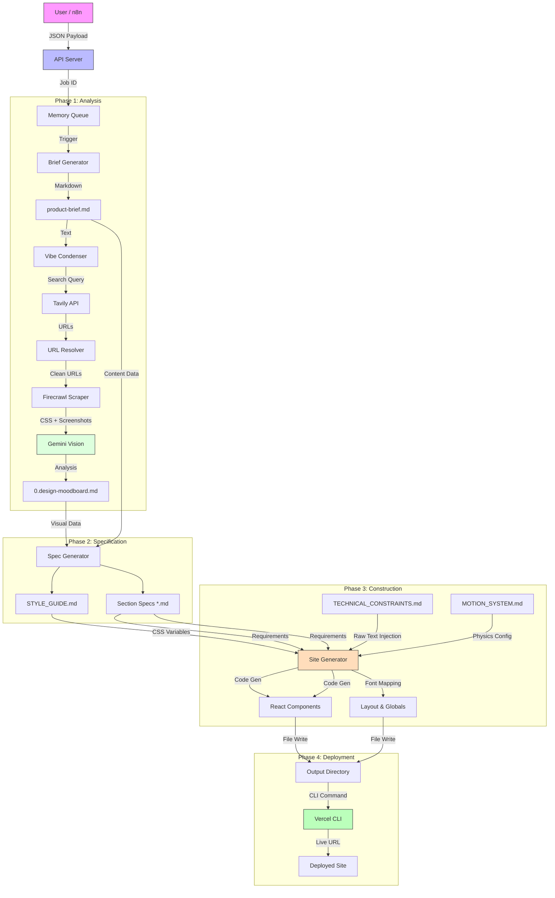

# Legacy System Deep Dive: The Lifecycle of a CV
*A "No Stone Untouched" Forensic Analysis of the Original Architecture*

## 1. The Trigger: Data Ingestion (Server Layer)
The process begins when an external source (n8n or Typeform) hits the API.

### 1.1 The Entry Point (`api/server.js`)
*   **Endpoint:** `POST /webhook/typeform` or `POST /generate`
*   **The Payload:** The system expects a specific set of 14 data points:
    *   **Identity:** Name, Role, Experience, Tagline, Bio ("About").
    *   **Style:** "Vibe" (e.g., "Minimalist Dark Mode"), Avatar Image.
    *   **Contact:** Email, Social Links (relying on raw input).
    *   **Work:** Project list (Name, Role, Impact, Link).
*   **Job Creation:**
    *   Generates a UUID for the job.
    *   Stores initial state in an in-memory `Map` (No database).
    *   Returns `202 Accepted` + `jobId` immediately to the caller.

## 2. The Briefing Room: Data normalization
Before any AI touches the data, it must be normalized.

### 2.1 The Brief Generator (`scripts/orchestrator.js`)
*   **Logic:** Checks if a `product-brief.md` already exists.
*   **Action:** If missing, it calls the LLM (Gemini Flash) to format the raw JSON payload into a structured Markdown document.
*   **Why?** This creates a human-readable "Source of Truth" that subsequent, more expensive AI models can read easily without parsing complex JSON.

### 2.2 The Parser (`scripts/brief_parser.js`)
*   **The "Unavatar" Secret:** This script repairs missing images.
    *   If `brief.socials.twitter` exists -> Generates `unavatar.io/twitter/[handle]`.
    *   If no image exists -> Generates a text-based avatar via `ui-avatars.com`.
        *   *Critical:* This guarantees the generated site never has broken `src=""` attributes.
*   **Social Link Repair:**
    *   Detects if a user input just `@handle`.
    *   Prefixes with `https://x.com/` or `https://linkedin.com/in/` to ensure valid clickable links.

## 3. The Inspiration Engine: The "Eyes"
This is the most complex subsystem, responsible for gathered aesthetic intelligence.

### 3.1 Vibe Condenser
*   **Input:** "I want a site that looks like Apple but darker."
*   **Analysis:** An LLM converts this into a **Search Query** (e.g., "Dark Minimalist Portfolio Website").
*   **Rule:** If the query is >50 chars, it truncates/refines it to ensure search relevance.

### 3.2 The Search (Tavily)
*   **Scope:** Searches 8 specific design galleries:
    *   **Galleries:** `awwwards.com`, `godly.website`, `siteinspire.com`, `lapa.ninja`, `landingfolio.com`
    *   **Templates:** `framer.com/templates`, `webflow.com/templates`
    *   **Visual-Only:** `dribbble.com`, `behance.net` (Screenshots only, no code scraping)
*   **Filtering:** Ignores generic social media results (Instagram/Pinterest) to focus on High-Fidelity Web Design.

### 3.3 The Resolution (Template Logic)
*   **Problem:** A link to `framer.com/templates/portfolio` is a sales page, not the design itself.
*   **Solution:** The logic detects these URLs and scrapes them to find the **Preview URL** (e.g., `demo-portfolio.framer.website`), ensuring the visual analysis sees the actual design, not the marketplace UI.

### 3.4 Hybrid Extraction (Firecrawl)
*   **Dual-Pass Scraping:**
    1.  **Pass 1 (Screenshot):** Captures a full-page screenshot of the resolved URL.
    2.  **Pass 2 (Branding):** Extracts computed CSS values (Font Families, Colors, Spacing tokens).
*   **Synthesis:** Combines the "Math" (CSS tokens) with the "Visuals" (Screenshot).

### 3.5 Vision Analysis
*   **The Brain:** Gemini Vision Pro.
*   **Task:** Looks at the screenshots to identify things code cannot see:
    *   "Layout Patterns" (e.g., Bento Grid vs. Split Screen).
    *   "Animation Clues" (e.g., Parallax hints, Hove states).
*   **Output:** Generates `0.design-moodboard.md`, a rich document containing palettes, fonts, and "vibes".

## 4. The Architect: Structure & Spec
Now the system decides *what* to build.

### 4.1 Specification Phase (`scripts/spec_generator.js`)
*   **Dynamic Sectioning:**
    *   Reads the Brief.
    *   *If* brief contains "Testimonial" keywords -> Adds `testimonials.md` spec.
    *   *If* brief implies technical role -> Adds `skills.md` spec.
*   **Style Guide Creation:**
    *   Generates `STYLE_GUIDE.md`.
    *   Enforces `clamp()` for fluid typography (scaling from mobile to desktop without media queries).
*   **Requirement Documentation:** Generates `PROJECT_REQUIREMENTS.md` as a manifest for the build.

## 5. The Builder: Code Generation
The system constructs the actual Next.js application.

### 5.1 The Scaffold (`scripts/site_generator.js`)
*   **Filesystem Ops:**
    *   Creates `package.json` with exact dependencies (`framer-motion`, `phosphor-icons`).
    *   Writes `tsconfig.json`, `next.config.js`, `tailwind.config.js`.
*   **The Global Style Hack:**
    *   Reads `STYLE_GUIDE.md` text.
    *   Extracts the CSS code block via Regex.
    *   Writes it directly to `app/globals.css`. *This is how the AI's "Vibe" becomes the site's CSS variables.*

### 5.2 The Monolithic Generation
*   **Strategy:** "One Prompt to Rule Them All".
*   **Input:** Brief + Moodboard + Style Guide + All Section Specs.
*   **Prompt:** A massive "Elite Frontend Engineer" persona prompt.
*   **Output:** A single markdown block containing code for *every* component, separated by `### SECTION: [name] ###`.
*   **Why?** Generating all sections in one pass ensures they share the exact same design language and don't feel like mismatched parts.

### 5.3 Font Parsing
*   **Discovery:** Scans the Style Guide for font names (e.g., "Playfair Display").
*   **Mapping:** Matches them to `next/font/google` imports.
*   **Injection:** Creates `app/layout.tsx` dynamically importing *only* the chosen fonts.

### 5.4 The "Raw Injection" (Constraints)
*   **The File:** `prompts/TECHNICAL_CONSTRAINTS.md` (Not a script, a rulebook).
*   **The Mechanism:**
    *   This file is **NOT parsed** into JSON or code rules.
    *   It is read as a raw text blob and injected directly into the System Prompt under `## TECHNICAL CONSTRAINTS`.
    *   **Implication:** There is no code-level validation for things like `Math.random()`. The system relies entirely on the LLM's obedience to this injected text file.

### 5.5 The "Alchemy" (Style Guide Generation)
*   **The Problem:** The Moodboard (`0.design-moodboard.md`) is chaotic (Hex codes mixed with "vision" text).
*   **The Alchemist:** `scripts/spec_generator.js`.
*   **The Process:**
    1.  **Persona:** Instantiates as a "World-Class Design Systems Engineer".
    2.  **Synthesis:** The LLM is forced to translate "Vibes" into "Variables".
        *   *Input:* "Moodboard says dark mode with neon accents."
        *   *Output:* `var(--color-primary): #39FF14;`
    3.  **Normalization:** The LLM calculates fluid typography clamps (`clamp(2rem, 5vw, 4rem)`) based on the requested "boldness" of the vibe.
*   **Result:** A chaotic input becomes a strict, machine-readable `STYLE_GUIDE.md` which potentially acts as the database for the CSS.

## 6. Deployment (The Finish Line)
The final step makes the site live.

### 6.1 Verification (Optional)
*   Runs `npm run build` locally in a child process.
*   If it fails, it catches the error (though auto-fix was not fully implemented in legacy).

### 6.2 Vercel CLI (`scripts/deploy_service.js`)
*   **Tool:** Uses `vercel` CLI command.
*   **Auth:** Uses `VERCEL_API_TOKEN` env var.
*   **Action:**
    1.  Generates `vercel.json` config.
    2.  Executes `vercel --prod` to push the `output/` directory.
*   **Result:** Returns the live `*.vercel.app` URL to the API response.

---

## 7. Motion System Upgrade (Jan 2026)
To achieve "Awwwards-level" quality, the system was upgraded with a dedicated Physics Engine.

### 7.1 The Rulebook (`prompts/MOTION_SYSTEM.md`)
*   **Purpose:** Defines 2 distinct motion profiles using React Spring physics.
    *   **STUDIO:** Overdamped, heavy (Mass: 1, Stiffness: 70).
    *   **TECH:** Underdamped, snappy (Mass: 0.8, Stiffness: 150).

### 7.2 The Spec Generator Selection Logic
*   **Change:** The Architect prompt now includes a step to *analyze* the vibe and choose `STUDIO` or `TECH`.
*   **Output:** Writes `MOODBOARD_CONFIG` at the bottom of the Style Guide.

### 7.3 The Physics Injection
*   **Change:** The Site Generator reads `MOTION_SYSTEM.md` and injects it into the Builder prompt.
*   **Enforcement:** It forces the AI to check the Style Guide's config and apply the matching physics constants to all `framer-motion` variants.

---

## System Flowchart

